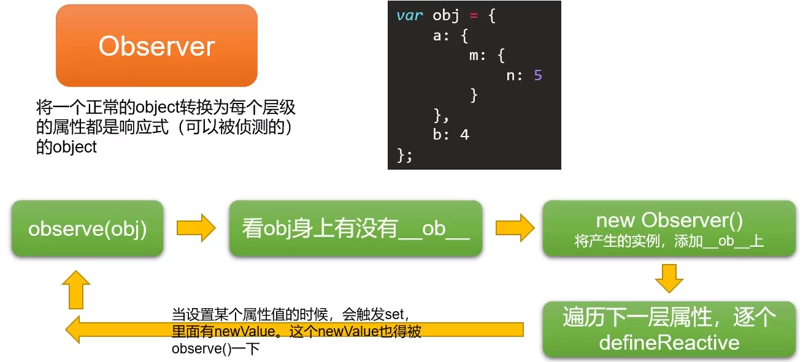
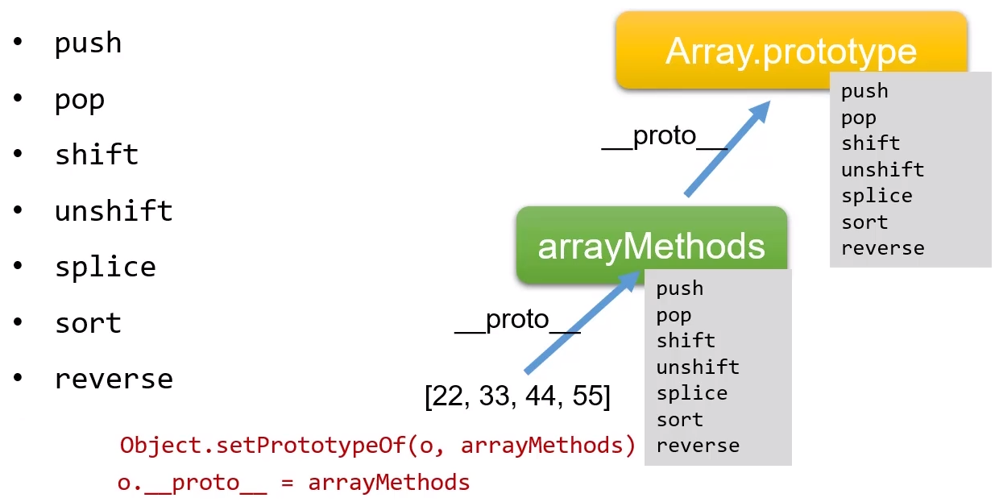
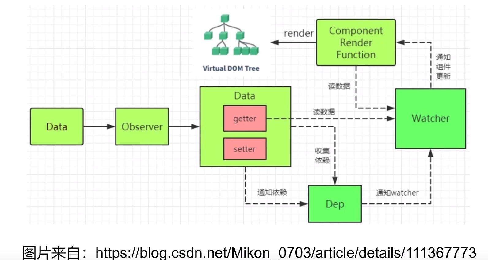

# vue-reactive（数据响应式原理）

**MVVM模式：**


模板：

`<p>我{{age}}岁了</p>`

数据变化：

`this.age++；`

**数据变了视图会自动变化，这到底如何实现的？** 

## Object.defineProperty()方法

**数据劫持**：Object.defineProperty()利用javascrip引擎赋予的功能，监测对象属性变化

它可以设置一些额外隐藏的功能，如writable（是否可写）Enumerable（是否可以被枚举）

基本的数据劫持的实现：

```vue
var obj = {
    a: 10,
    b: 20
};
Object.defineProperty(obj, 'a', {
    get() {
        console.log('你在得到a的值');
}，
set() {
        console.log('你在改变变量a的值');
    }
});
console.log(obj.a);
obj.a = 6;
```

只要你劫持了，你用到a的时候，此时a的值就是get()的返回值。

术语上set()函数叫做setter，get()函数叫做getter

为了能够真正的让Object.defineProperty()工作，这个时候可以使用变量中转。

```vue
var obj = {
    a: 10,
    b: 20
};
var temp = obj.a;
Object.defineProperty(obj, 'a', {
    set(newValue) {
        console.log('你在改变变量a的值');
        temp = newValue;
    },
    get() {
        console.log('你在得到a的值');
        return temp;
    }
});
console.log(obj.a);
obj.a = 6;
console.log(obj.a);
```

## defineReactive函数

Vue底层使用函数的闭包存储这个临时变量，很厉害的一个创举

```vue
var obj = {
    a: 10,
    b: 20
};

// 注意，这里的第三个参数有一个等号，这个等号是ES6的默认值的意思。
// 意思就是说，如果这个参数没有传，那么就会用obj[key]当做这个参数的值。
function reactive(obj, key, value = obj[key]) {
    // 注意这里的形参value，就是set()函数和get()函数的闭包。
    Object.defineProperty(obj, key, {
        get() {
            console.log('你在得到' + key + '的值');
            return value;
        }，
 set(newValue) {
            console.log('你在改变' + key + '的值');
            value = newValue;
        }
    });
}
reactive(obj, 'a');
reactive(obj, 'b');
console.log(obj.a);
console.log(obj.b);
```

## 递归侦测对象的全部属性

对象的每一层都必须是响应的，Observer类来解决这个问题。



此时我们只要在index.js文件中：

`new Observer(obj);`

此时这个对象每个第一层属性都能够变为响应式。

我们要将它的每一层都变为响应式，所以就是一种递归的形式。

递归是Observer类和defineReactive函数共同配合实现的。两个文件互相引用，然后形成递归。

## 数组的**响应式**处理

底层机制就是改写七个方法。



Object.setPrototypeOf() 这个方法可以改变一个东西的原型。

```vue
export default function (arr) {
    var methodNames = [
        'push',
        'pop',
        'unshift',
        'shift',
        'reverse',
        'sort',
        'splice'
    ];
    // 创建一个对象，这个一会儿要成为array的新的原型链。
    var arrayMethods = Object.create(Array.prototype);

    methodNames.forEach(methodName => {
        arrayMethods[methodName] = function () {
            console.log( methodName + '方法，已经被改写了，调用JS默认的' + methodName + '方法');
            Array.prototype[methodName].apply(this, arguments);
        }
    });

    return arrayMethods;
};
```

## 收集依赖

需要用到数据的地方称为依赖

Vue1中，细粒度依赖，用到数据的Dom就是依赖

Vue2中，中等粒度依赖，用到数据的组件就是依赖

**在getter中收集依赖，在setter中触发依赖。**

### Dep和Watcher

把依赖收集的的代码封装成一个Dep类，它专门用来管理依赖，每个Observer的实例成员中都有一个Dep的实例。

Watcher是一个中介，数据发生变化时通过Watcher中转，通知组件。



- 依赖就是Watcher，只有Watcher触发的getter才会收集依赖，哪个Watcher触发了getter，就把哪个Watcher收集到Dep中。
- Dep使用发布订阅模式，当数据发生变化时，会循环依赖列表，把所有的Watcher都通知一遍。
- 代码实现的巧妙之处是：Watcher把自己设置到一个全局的指定位置，然后读取数据，，读取数据就会触发这个数据的getter，在getter中就可以得到的当前正在的取数据的Watcher，并把这个Watcher收集到Dep中。

